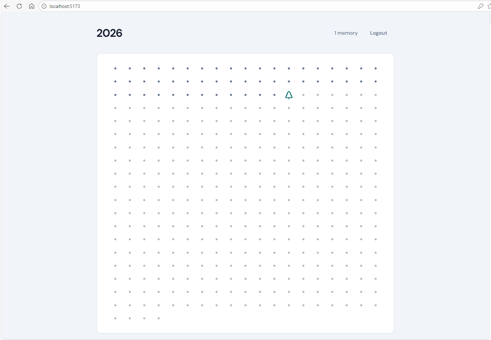
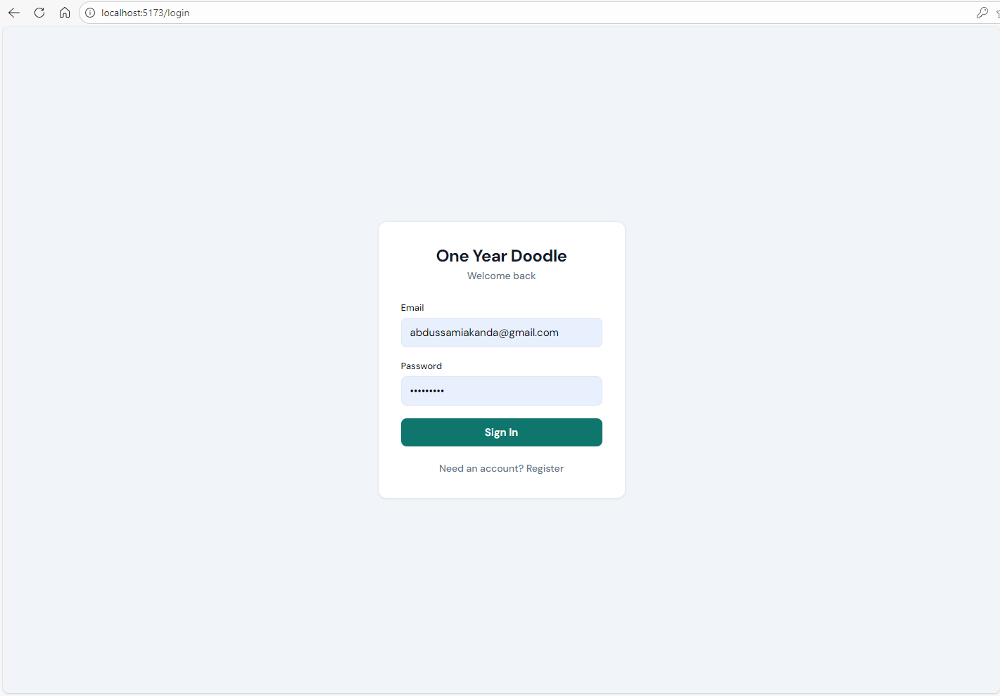

# One Year Doodle

A daily journal app with a visual garden metaphor: each day of the year is a cell in a grid. Write one memory per day and get a unique doodle (plant, flower, or insect) for that cell.


*The garden grid showing your year of memories*

## Features

- **🌱 Visual Garden**: Year grid where each cell represents a day—empty, today (glowing dot), or filled with a unique doodle
- **📝 Daily Journaling**: Write one memory per day with a simple, focused editor
- **🎨 Unique Doodles**: Each entry gets a random doodle from a pool of 50 icons (no duplicates in your year)
- **🔐 Secure Auth**: Email/password authentication via Supabase with Row Level Security
- **📱 Responsive Design**: Works beautifully on desktop and mobile devices


*Writing today's memory*

## Tech Stack

- **Frontend**: Vite + React (JS/JSX)
- **Styling**: Plain CSS (no frameworks)
- **Backend**: Supabase (PostgreSQL + Auth)
- **Icons**: Lucide React

## Quick Start

### Prerequisites

- Node.js 18+ and npm
- A [Supabase](https://supabase.com) account (free tier works)

### Installation

1. **Clone and install**:

   ```bash
   git clone <your-repo-url>
   cd doodle-journal
   npm install
   ```

2. **Set up Supabase**:

   - Create a new project at [supabase.com](https://supabase.com)
   - Go to **Settings → API** and copy your **Project URL** and **anon public** key

3. **Configure environment**:

   Create a `.env` file in the project root:

   ```env
   VITE_SUPABASE_URL=https://your-project.supabase.co
   VITE_SUPABASE_ANON_KEY=your-anon-key-here
   ```

4. **Set up the database**:

   - Open the Supabase SQL Editor
   - Copy and paste the contents of `supabase-schema.sql`
   - Run the SQL to create tables, RLS policies, and triggers

5. **Start the dev server**:

   ```bash
   npm run dev
   ```

   Open [http://localhost:5173](http://localhost:5173) and sign up!

## Screenshots

### Login Screen

*Sign up or sign in to start journaling*

### Garden View

*The main garden grid showing all 365 days*

### Journal Entry

*Viewing a past entry with its doodle*

## Project Structure

```
src/
├── components/
│   ├── garden/          # GardenGrid, GardenCell, YearHeader
│   ├── journal/         # JournalEditor, EntryDisplay, JournalHeader
│   ├── doodles/         # DoodleIcon component
│   └── ui/              # Button, Card, Loading
├── contexts/
│   ├── AuthContext.jsx  # Authentication state
│   └── JournalContext.jsx # Journal entries state
├── lib/
│   ├── supabase.js      # Supabase client
│   ├── dates.js         # Date utilities
│   ├── doodle-icons.js  # Doodle icon mapping
│   └── constants.js     # App constants
├── pages/
│   ├── Login.jsx        # Auth page
│   ├── Home.jsx         # Garden grid page
│   └── Journal.jsx      # Entry view/edit page
├── App.jsx              # Router setup
├── main.jsx             # Entry point
└── index.css            # Global styles and theme
```

## Scripts

| Command           | Description                    |
|-------------------|--------------------------------|
| `npm run dev`     | Start development server       |
| `npm run build`   | Create production build         |
| `npm run preview` | Preview production build        |
| `npm run lint`    | Run ESLint                     |

## Environment Variables

| Variable                | Description                          |
|-------------------------|--------------------------------------|
| `VITE_SUPABASE_URL`    | Your Supabase project URL            |
| `VITE_SUPABASE_ANON_KEY` | Your Supabase anonymous (public) key |

## Database Schema

The app uses two main tables:

- **`profiles`**: User profiles with username (linked to `auth.users`)
- **`entries`**: Journal entries with `date_key`, `text`, `doodle_id`, timestamps

See `supabase-schema.sql` for the complete schema including:
- Table definitions
- Row Level Security (RLS) policies
- Indexes for performance
- Trigger function for auto-creating profiles on signup

## How It Works

1. **Sign Up**: Create an account with email/password and username
2. **Garden View**: See all 365 days of the year in a grid
3. **Today's Entry**: Click today's cell (glowing dot) to write your memory
4. **Past Entries**: Click any filled cell to view that day's entry
5. **Doodle Assignment**: Each new entry gets a random unused doodle from the pool

## Troubleshooting

### Save times out or never completes

If the "Done" button times out when saving:

1. **Check Supabase project status**:
   - Go to [Supabase Dashboard](https://supabase.com/dashboard)
   - If your project shows "Project is paused", click **Restore**
   - Wait 20-30 seconds for the project to resume (first request after resume can be slow)

2. **Verify environment variables**:
   - Check `.env` has correct `VITE_SUPABASE_URL` and `VITE_SUPABASE_ANON_KEY`
   - Restart the dev server after changing `.env`

3. **Check browser console**:
   - Open DevTools → Console
   - Look for Supabase errors or network issues

4. **Verify database setup**:
   - Ensure `supabase-schema.sql` was run successfully
   - Check that RLS policies are enabled in Supabase Dashboard → Authentication → Policies

### Can't sign up or log in

- Verify your Supabase project URL and anon key in `.env`
- Check Supabase Dashboard → Authentication → Settings for email confirmation requirements
- Ensure the `profiles` table and trigger were created (see `supabase-schema.sql`)

## License

MIT

---

**One memory per day. One year, one garden.** 🌱
